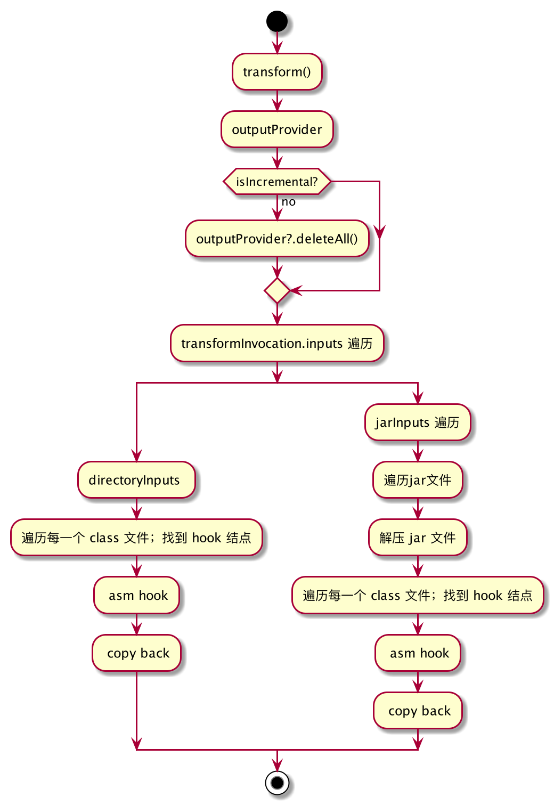
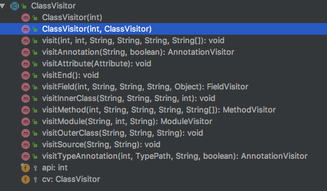

[TOC]

## 一、自定义Gradle插件

1. 新建一个module，将build.gradle改为以下代码：

```groovy
apply plugin: 'groovy'
apply plugin: 'maven'

dependencies {
    compile gradleApi()     //gradle sdk
    compile localGroovy()   //groovy sdk
    compileOnly 'com.android.tools.build:gradle:3.5.3'
}

repositories {
    jcenter()
}

//主要用于上传插件
uploadArchives {
    repositories.mavenDeployer {
        //本地仓库路径，以放到项目根目录下的 repo 的文件夹为例
        repository(url: uri('../repo'))

        //groupId ，自行定义
        pom.groupId = 'com.jesse'

        //artifactId，自行定义
        pom.artifactId = 'autotrack.android'

        //插件版本号
        pom.version = '1.0.0'
    }
}
```

2. 创建plugin所需要的目录

   - 删除src目录下的所有文件，然后再src/main目录下创建groovy目录，然后在该目录下新建一个package，例如com.jesse.autotrack.plugin
   - 创建properties文件，在src/main目录下依次创建目录resources/META-INF/gradle-plugins，然后在该目录下创建一个后缀名为properties的文件，用来声明插件的名称以及对应插件的包名和类名，比如我们新建com.jesse.testplugin.properties

3. 实现插件

   在src/main/groovy目录的package下新建一个TestPlugin.groovy类，该类主要实现了plugin接口，内容很简单就是打印了一句话：

   ```groovy
   class TestPlugin implements Plugin<Project> {
   
       @Override
       void apply(Project project) {
           def config = project.extensions.create('config', PluginConfig)
           project.task('testTask') {
               doLast {
                   println('hello testTask ' + config.debug)
               }
           }
       }
   }
   ```

其中的config字段就是Extension，说白了就是用于在gradle中传递参数给插件用的，PluginConfig就是这个字段的所属类，我们这里也需要新建这个类，可以看到这个类里面就写了一个属性debug

```groovy
package com.jesse.autotrack

class PluginConfig {
    boolean debug
}
```

4. 修改com.jesse.testplugin.properties

   在其中添加`implementation-class=com.jesse.autotrack.plugin.TestPlugin`

5. ./gradlew uploadArchives编译发布插件

6. 使用插件

   - 在project根目录的build.gradle文件中引入插件
   - 在app/build.gradle中引入插件

7. ./gradlew testTask 执行task，打印如下

   > Task :app:testTask
   > hello testTask true

## 二、自定义Transform

#### 定义

​	Transform 是Android 官方提供给开发者在项目编译阶段，也就是.class到.dex转换期间，用来修改.class的一套标准API，目前比较经典的就是字节码插桩和代码注入，概括的说就是**把输入的.class文件转换为目标字节码**

#### 主要方法

```groovy
    /**
     * 需要处理的数据类型，有两种枚举类型
     * CLASSES 代表处理的 java 的 class 文件，RESOURCES 代表要处理 java 的资源
     * @return
     */
    @Override
    Set<QualifiedContent.ContentType> getInputTypes() {
        return TransformManager.CONTENT_CLASS
    }

    /**
     * 指 Transform 要操作内容的范围，官方文档 Scope 有 7 种类型：
     * 1. EXTERNAL_LIBRARIES        只有外部库
     * 2. PROJECT                   只有项目内容
     * 3. PROJECT_LOCAL_DEPS        只有项目的本地依赖(本地jar)
     * 4. PROVIDED_ONLY             只提供本地或远程依赖项
     * 5. SUB_PROJECTS              只有子项目。
     * 6. SUB_PROJECTS_LOCAL_DEPS   只有子项目的本地依赖项(本地jar)。
     * 7. TESTED_CODE               由当前变量(包括依赖项)测试的代码
     * @return
     */
    @Override
    Set<QualifiedContent.Scope> getScopes() {
        return TransformManager.SCOPE_FULL_PROJECT
    }

    /**
     * 是否是增量编译
     * @return
     */
    @Override
    boolean isIncremental() {
        return false
    }

    /**
     * 字节码转换的主要逻辑
     * @param transformInvocation
     * @throws TransformException
     * @throws InterruptedException
     * @throws IOException
     */
    @Override
    void transform(TransformInvocation transformInvocation) throws TransformException,InterruptedException, IOException {
        println("-----------transform >>>>>>>>> 开始-----------" + getName())
        _transform(transformInvocation.context, transformInvocation.inputs,
                transformInvocation.outputProvider, transformInvocation.incremental)
    }
  
```

#### 主要流程



可以看到我们需要**重写transform()方法，在其中我们首先需要判断是否是增量更新，如果不是增量更新，也就是全量更新的话，需要先删除全部输出outputProvider.deleteAll()，接着再去遍历输入，输入主要分为目录和Jar文件的遍历，最终的处理方式都是一样的，找到合适的hook点，通过ASM的方式修改.class文件，最后再拷贝回去**，根据Transform的处理流程，我抽象出来了一个BaseTransform类，以后自定义Transform只需要继承这个类的三个方法，不需要关注中间的文件的处理过程：

```groovy
class TestTransform extends BaseTransform {
    /**
     * 过滤需要修改的class文件
     * @param className
     * @return
     */
    @Override
    boolean isShouldModify(String className) {
        return false
    }
		/**
     * 修改class文件
     * @param srcClass 源class
     * @return 目标class
     * @throws IOException
     */
    @Override
    byte[] modifyClass(byte[] srcClass) throws IOException {
        return srcClass
    }

    @Override
    String getName() {
        return "TestTransform"
    }
}
```

#### 注册Transform

自定义一个gradle插件，在apply方法中，通过AppExtension的registerTransform来注册Transform

```groovy
AppExtension appExtension = project.extensions.findByType(AppExtension.class)
appExtension.registerTransform(new TestTransform())
```

## 三、ASM

#### 定义

​	ASM是一个功能齐全的字节码操作与分析框架，通过ASM，我们可以通过动态的生成类和改善既有类的功能。

#### 核心类

- ClassReader

  用来解析编译后的 .class字节码文件

- ClassWriter

  用来重新构建编译后的类，比如修改类名，属性和方法，甚至可以生成新的类

- ClassVisitor

  用来拜访类的所有信息，实现类的字节码操作，包括类上的注解，构造方法，属性，方法和静态代码块

- AdviceAdapter

  实现了MethodVisitor接口，用来拜访方法的所有信息，实现方法的字节码操作

#### ClassVisitor



##### visit()

该方法是扫描类时第一个会调用的方法，方法的完整定义如下：

```groovy
void visit(int version, int access, String name, String signature, String superName, String[] interfaces)
```

version: jdk的版本

access: 类的修饰符

name: 类的名称，类似于a/b/c/MyClass

signature: 范型信息

superName：继承的父类

interfaces：实现的接口数组

##### visitMethod()

该方法是扫描方法的时候会调用的，完整定义如下：

```groovy
public MethodVisitor visitMethod(int access, String name, String desc, String signature, String[] exceptions)
```

access: 修饰符，例如ACC_PUBLIC

name：方法名

desc：方法签名，即“（参数列表）返回值类型”。 注意“Z” 代表boolean , "J"代表Long

signature: 范型信息

exceptions：抛出的异常信息，没有异常则为空

#### onClick事件无痕埋点

我们在上一节中自定义的Transform中的modifyClass方法中修改字节码，代码如下：

```groovy
@Override
byte[] modifyClass(byte[] srcClass) throws IOException {
    ClassWriter classWriter = new ClassWriter(ClassWriter.COMPUTE_MAXS)
    ClassVisitor classVisitor = new AutoTrackClassVisitor(classWriter)
    ClassReader cr = new ClassReader(srcClass)
    cr.accept(classVisitor, ClassReader.SKIP_FRAMES)
    return classWriter.toByteArray()
}
```

我们主要看AutoTrackClassVisitor类的实现：

```groovy
@Override
void visit(int version, int access, String name, String signature, String superName, String[] interfaces) {
    super.visit(version, access, name, signature, superName, interfaces)
    mInterfaces = interfaces
}

@Override
MethodVisitor visitMethod(int access, String name, String desc, String signature, String[] exceptions) {
    MethodVisitor methodVisitor = super.visitMethod(access, name, desc, signature, exceptions)

    String nameDesc = name + desc

    methodVisitor = new AutoTrackDefaultMethodVisitor(methodVisitor, access, name, desc) {


        @Override
        protected void onMethodExit(int opcode) {
            super.onMethodExit(opcode)

            if ((mInterfaces != null && mInterfaces.length > 0)) {
                if ((mInterfaces.contains('android/view/View$OnClickListener') && nameDesc == 'onClick(Landroid/view/View;)V')) {
                    methodVisitor.visitVarInsn(ALOAD, 1)
                    methodVisitor.visitMethodInsn(INVOKESTATIC, SDK_API_CLASS, "trackViewOnClick", "(Landroid/view/View;)V", false)
                }
            }
        }
    }
    return methodVisitor
}
```

可以看到我们首先会从visit方法中拿到所有实现的接口，然后再在visitMethod方法中返回一个自定义的MethodVisitor对象，在方法出口处插桩，实现了OnClickListener接口，onClick方法返回之前插入一段代码

#### 完善

##### 支持通过android:onClick属性绑定的点击事件

由于这种方式是通过在运行时反射的方式调用响应函数的，所以我们需要使用注解匹配的方法，匹配到响应函数，再进行hook操作。

```groovy
@Override
AnnotationVisitor visitAnnotation(String s, boolean b) {
    //扫描到自定义注解
    if (s == 'Lcom/sensorsdata/analytics/android/sdk/SensorsDataTrackViewOnClick;') {
        isSensorsDataTrackViewOnClickAnnotation = true
    }
    return super.visitAnnotation(s, b)
}

```

```groovy
@Override
protected void onMethodExit(int opcode) {
    super.onMethodExit(opcode)
    //hook 注解SensorsDataTrackViewOnClick标识的方法，为了解决在xml中注册的方法无法在编译期间hook的问题，只能通过手动添加自定义注解
    if (isSensorsDataTrackViewOnClickAnnotation) {
        if (desc == '(Landroid/view/View;)V') {
            methodVisitor.visitVarInsn(ALOAD, 1)
            methodVisitor.visitMethodInsn(INVOKESTATIC, SDK_API_CLASS, "trackViewOnClick", "(Landroid/view/View;)V", false)
            return
        }
    }
}
```

##### 支持lambda表达式

访问lambda表达式的时候，会调用INVOKEDYNAMIC指令，调用visitInvokeDynamicInsn方法，在其中，先获取自定义的内部类方法的hook对象，然后将hook对象缓存到map里，key值为lambda方法

```groovy
/**
 * 访问INVOKEDYNAMIC指令，访问lambda表达式的时候调用
 */
@Override
void visitInvokeDynamicInsn(String name1, String desc1, Handle bsm, Object... bsmArgs) {
    super.visitInvokeDynamicInsn(name1, desc1, bsm, bsmArgs)

    try {
        String desc2 = (String) bsmArgs[0]
        //获取内部类方法的hook对象，比如onClick
        AutoTrackMethodCell sensorsAnalyticsMethodCell = AutoTrackHookConfig.LAMBDA_METHODS.get(Type.getReturnType(desc1).getDescriptor() + name1 + desc2)
        if (sensorsAnalyticsMethodCell != null) {
            Handle it = (Handle) bsmArgs[1]
            //将hook对象缓存到map里，key值为lambda方法，例如lambda$onCreate$0
            mLambdaMethodCells.put(it.name + it.desc, sensorsAnalyticsMethodCell)
        }
    } catch (Exception e) {
        e.printStackTrace()
    }
}
```

接着我们需要在对应的lambda方法出口，写入相关的切面代码

```groovy
@Override
protected void onMethodExit(int opcode) {
    super.onMethodExit(opcode)

    //处理lambda表达式的hook
    AutoTrackMethodCell lambdaMethodCell = mLambdaMethodCells.get(nameDesc)
    if (lambdaMethodCell != null) {
        Type[] types = Type.getArgumentTypes(lambdaMethodCell.desc)
        int length = types.length
        Type[] lambdaTypes = Type.getArgumentTypes(desc)
        int paramStart = lambdaTypes.length - length
        //过滤参数不一致的方法
        if (paramStart < 0) {
            return
        } else {
            for (int i = 0; i < length; i++) {
                if (lambdaTypes[paramStart + i].descriptor != types[i].descriptor) {
                    return
                }
            }
        }
        //加载参数，类似mv.visitVarInsn(ALOAD, 0)
        boolean isStaticMethod = AutoTrackUtils.isStatic(access)
        for (int i = paramStart; i < paramStart + lambdaMethodCell.paramsCount; i++) {
            methodVisitor.visitVarInsn(lambdaMethodCell.opcodes.get(i - paramStart), AutoTrackUtils.getVisitPosition(lambdaTypes, i, isStaticMethod))
        }
        //加载方法
        methodVisitor.visitMethodInsn(INVOKESTATIC, SDK_API_CLASS, lambdaMethodCell.agentName, lambdaMethodCell.agentDesc, false)
        return
    }
}
```